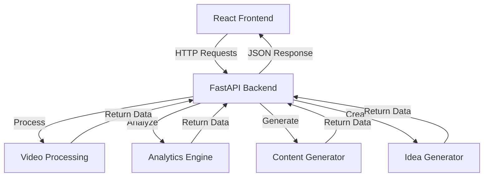

# YouTube Productivity Tools 🚀📊

<div align="center">
  
  

  ### A comprehensive platform for YouTube creators to analyze, optimize, and elevate their content
  
  [](https://reactjs.org/)
  [](https://www.typescriptlang.org/)
  [](https://fastapi.tiangolo.com/)
  [](https://tailwindcss.com/)
  [](https://opensource.org/licenses/MIT)
  
</div>

## 📋 Table of Contents

- [Overview](#-overview)
- [Features](#-features)
- [Tech Stack](#-tech-stack)
- [Architecture](#-architecture)
- [Getting Started](#-getting-started)
- [API Endpoints](#-api-endpoints)
- [Screenshots](#-screenshots)
- [Roadmap](#-roadmap)
- [Contributing](#-contributing)
- [License](#-license)

## 🌟 Overview

**YouTube Productivity Tools** is an all-in-one platform designed for content creators who want to elevate their YouTube presence. The application provides a suite of tools for analyzing video performance, generating content ideas, optimizing video metadata, and processing video content into different formats.

Whether you're a beginner starting your YouTube journey or an established creator looking to optimize your workflow, this platform offers valuable tools to save time and improve your content strategy.

## ✨ Features

### 🎬 Video Processing Tools
- **Transcript Extraction** - Get accurate transcripts from any YouTube video
- **Video Summarization** - Generate concise summaries of video content
- **Blog Post Generation** - Transform video content into well-structured blog posts

### 📊 Video Analytics
- **Performance Metrics** - View counts, likes, comments statistics
- **Audience Demographics** - Age, gender, and location insights
- **Engagement Trends** - Track performance over time
- **Retention Analysis** - Understand where viewers drop off

### 📝 Content Creation Tools
- **Title Generation** - Create engaging titles optimized for search
- **Description Writing** - Generate comprehensive video descriptions
- **Tag Suggestions** - Get relevant tags to improve discoverability
- **Thumbnail Ideas** - Creative concepts for eye-catching thumbnails

### 💡 Idea Generator
- **Video Ideas** - Get inspired with new content ideas based on your existing videos
- **Trending Topics** - Discover what's popular in your niche
- **Content Series** - Ideas for multi-part content to keep viewers engaged

### 👥 Platform Information
- **Contact Page** - Get in touch with the development team
- **About Page** - Learn about the platform's mission and team

## 🛠️ Tech Stack

### Frontend
| Technology | Version | Purpose |
|------------|---------|---------|
| React | 18.3.1 | UI library |
| TypeScript | 5.5.3 | Type safety |
| Tailwind CSS | 3.4.1 | Styling |
| React Router | 6.22.3 | Navigation |
| Axios | 1.6.7 | API requests |
| Framer Motion | 12.4.7 | Animations |
| Lucide React | 0.344.0 | Icons |

### Backend
| Technology | Version | Purpose |
|------------|---------|---------|
| Python | 3.8+ | Server language |
| FastAPI | 0.104.1 | Web framework |
| Uvicorn | 0.23.2 | ASGI server |
| Pydantic | 2.4.2 | Data validation |

## 🏗️ Architecture



## 🚀 Getting Started

### Prerequisites
- Node.js (v16 or higher)
- Python (v3.8 or higher)
- npm or yarn

### Installation

1. **Clone the repository**
```bash
git clone https://github.com/yourusername/youtube-productivity-tools.git
cd youtube-productivity-tools
```

2. **Install frontend dependencies**
```bash
npm install
# or
yarn install
```

3. **Install backend dependencies**
```bash
cd backend
pip install -r requirements.txt
```

### Running the Application

1. **Start the frontend development server**
```bash
npm run dev
# or
yarn dev
```

2. **Start the backend server**
```bash
cd backend
python main.py
```

3. **Access the application**
Open your browser and navigate to `http://localhost:5173`

## 📡 API Endpoints

| Endpoint | Method | Description | Request Body |
|----------|--------|-------------|-------------|
| `/video-tools` | POST | Process video for transcript, summary, and blog post | `{ "url": "youtube_url" }` |
| `/video-analytics` | POST | Get analytics data for a video | `{ "url": "youtube_url" }` |
| `/content-creation` | POST | Generate content ideas based on topic | `{ "topic": "your_topic" }` |
| `/idea-generator` | POST | Generate video ideas based on existing content | `{ "url": "youtube_url" }` |
| `/contact` | POST | Submit contact form | `{ "name", "email", "subject", "message" }` |

## 📱 Screenshots

<div align="center">


*Home Page*

</div>

## 🔮 Roadmap

- **User Authentication** - Secure login and user profiles
- **YouTube API Integration** - Direct channel management
- **AI-powered Thumbnail Generation** - Create thumbnails with AI
- **Competitive Analysis Tools** - Compare with similar channels
- **Batch Processing** - Handle multiple videos simultaneously
- **Custom Branding** - Personalized templates and themes
- **Content Calendar** - Schedule and plan your content strategy
- **Mobile App** - Access tools on the go

## 👥 Contributing

Contributions are welcome! Here's how you can contribute:

1. Fork the repository
2. Create a feature branch: `git checkout -b feature/amazing-feature`
3. Commit your changes: `git commit -m 'Add some amazing feature'`
4. Push to the branch: `git push origin feature/amazing-feature`
5. Open a Pull Request

Please make sure to update tests as appropriate.

## 📄 License

This project is licensed under the MIT License - see the LICENSE file for details.

---

<div align="center">

Made with ❤️ for YouTube creators

[Report Bug](https://github.com/yourusername/youtube-productivity-tools/issues) • [Request Feature](https://github.com/yourusername/youtube-productivity-tools/issues)

</div>
